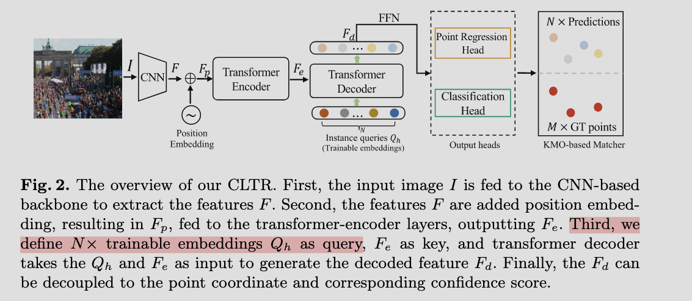
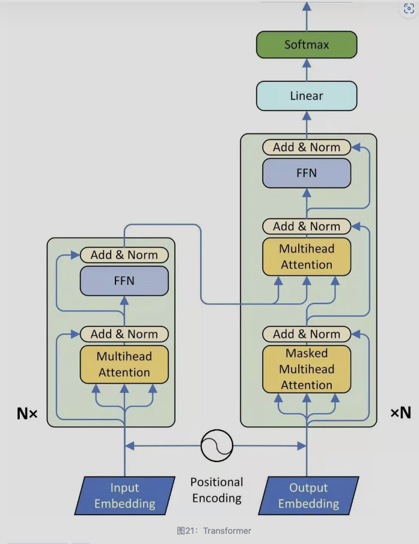
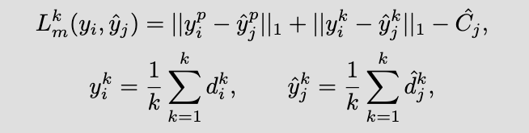

# CLTR architecture

CNN backbone + Transformer Encoder + Transformer Decoder + Point Regression Head & Classification Head

## CNN Backbone

1. 进入backbone之前，用了一个方法统一了输入samples，虽然每一个样本都被crop到$256 \times 256$，但是数据增强过程中难免出现图像比crop size还小的图片，所以这里通过padding让每一个输入图片都是一样的shape，padding值值是0，然后再创建出另一个与input一样大小的mask，mask中real image value为False，padding region为True.

2. 所以有两个输入进入进入CNN Backbone，一个为input另一个为mask，这里CNN使用的是ResNet50，中间的channels数为[64, 256, 512, 1024, 2048]，因此最后输出下采样$2^5$的特征图，with channels of 2048. 还有一个输出为mask，mask并没有channel数。

3. 这里得到backbone的输出后，先用这个输出input制作了position embedding,通道为256，由N_steps这个参数控制，这里的256可能要与transformer的输入channel匹配吧，确实position embedding怎么生成没搞懂。

4. 但是channel这么多的特征图不能直接输入Transformer Encoder中，所以先用一个$1\times1$卷积将channel数降为256，然后输入到Transformer Encoder中，这时输入x与pos都是256通道了，shape一般都为[B,256,8,8],因为下采样了5次。

## Transformer

1. 所以进入transformer encoder的有input [B,256,8,8]，mask [B,8,8]，pos [B,256,8,8]，还有query embedding 这个有700个，之后会作为Q来计数，shape为[700,256]

2. 在transformer内部，会reshape这些2d特征图, input为[64,B,256], pos为[64,B,256], mask为[B,64], query embedding为[700,B,256],我觉得query embedding可以理解成一个700个像素的图片，每一个像素都能预测一个坐标，然后通道为256.

### Transformer Encoder

1. 上面说的是进入Transformer的变量，因为其包括的encoder和decoder

2. 进入encoder的变量只有input [64,B,256], pos [64,B,256], mask [B,64]，因为query embedding是作为decoder的输入，所以这里没有query embedding。

3. encoder一般包括6个encoder layer，每一个layer 开头都会将pos与input相加，这个就是transformer添加位置信息的方式，可以理解成1个sequence有64个vector，每一个vector长度为256，添加位置信息的时候，就是要让vector的每一个元素加上一个值，这也是为什么pos与input 的shape一样，layer的输入都是input，pos，mask

4. 每一个layer会进行多头注意力计数，qkv就是从input与pos演变过来，有的模型用nn.linear生成qkv，有的用卷积生产，有的就直接把输出当作qkv。我觉得没必要探究。然后是add & layernrom，就是先残差链接后再norm，然后进入FFN，这个FFN一般有两个linear层，因此会有隐藏层这个超参数。最后进入add & layernorm

5. 每次进入encoder layer，input都会是来自上一层的结果，但是pos和mask一直没变

### Transformer Decoder

1. 进入decoder的变量有input [64,B,256], pos [64,B,256], mask [B,64], query embedding [700,B,256]，还一个tgt，即target embedding，shape与query embedding一样为[700,B,256]，这里的mask和pos与输入到encoder里面的一摸一样。

2. 进入decoder后，会先让query embedding输入MLP变成[700,B,2]，然后用sigmoid的再reshaped为[B,700,2]，称为参考点，值在0-1之间

3. 然后开始进入每一个decoder的layer，每一个layer最开始会把reference_points变成obj_center[700,B,2],然后会生成一个缩放因子pos_transformation，这个缩放因子是给属于query embedding的位置编码的，即query_sine_embed, shape为[700,B,256]，input也有一个自己的位置编码，就是那个pos，shape为[64,B,256]。所以这里有两个东西都有各自的位置编码，因为decoder其实有两个输入，一个是来自encoder的输出，一个是query embedding，就是额外的一个输入，这个决定了要生成多少个坐标。注意：query_sine_embed的生成是通过obj_center来生成的；一层的pos_transformation的生成的基于tgt，decoder layer缩放因子直接设置为1.

4. 第3点确实不好理解，所以最终输入每一个decoder layer为input [64,B,256], pos [64,B,256], mask [B,64], query embedding [700,B,256], query_sine_embed [700,B,256],以及tgt [700,B,256].第三点为了生成query_sine_embed使用了很多中间变量。

5. 然后先多头注意力机制，里面qkv都是基于tgt生成的，这里有点奇怪的，在encoder layer中是先让输入与pos相加后生成qkv，而这里的qkv是直接基于tgt生成的，然后在用q和k在分别加上pos。这个内部也很复杂，但是记住一个点，decoder layer包含了两个多头注意力+一个FFN，第二个多头注意力是cross-attention，意思是，它的v是来自encoder的输出，即input。由于input作为k，所以他的形状中256是没用的，最后输出的形状由q决定。

6. decoder内部确实很复杂，总之decoder返回两个变量，第一个是将6个layer的的输出都保存起来[6, B, 700, 256]为hs，另一个是参考点,[B,700,2],这个参考点没有输入到每一个decoder layer。

7. 然后遍历6个输出[6, 4, 700, 256]每一个输出都进入，进入regression head和classification head，分别得到[4, 700, 3]和[4, 700, 2]，前者的前两个元素还会加上参考点，参考点是对坐标的猜测，因为The transformer predicts relative offsets from the reference_point, not absolute coordinates.

## Loss Function

1. 首先使用匈牙利匹配算法，得到一个成本矩阵，即一个坐标为prediction，另一个坐标为target的一个成本矩阵,通过成本矩阵可以找到1对1匹配，就是哪个target匹配哪个prediction，会得到一个indices的数组，数组长度为Batch size，每一个数组两个元素，一个为target的下标，一个为prediction的下标

2. 得到匹配的好的点对，就可以对这个点对，计算损失函数，利用L1 loss和classification loss来计算。注意这里用到了一个辅助损失函数，就是重复同样的步骤，但是针对的是其他5个层的结果

## Validation

验证的时候，bs为1，但是每一张图片会padding后在crop成很多张进行验证，因为输入图片的大小只能是crop大小。